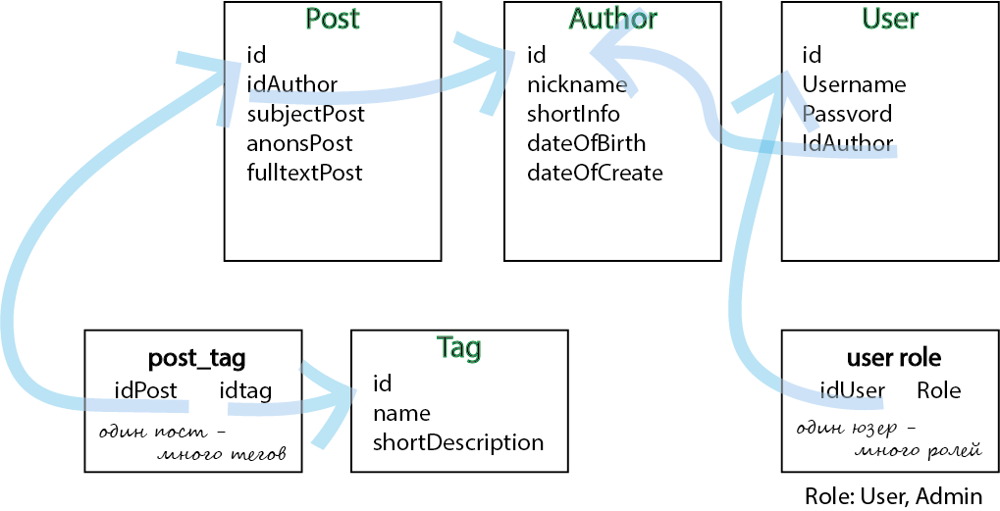
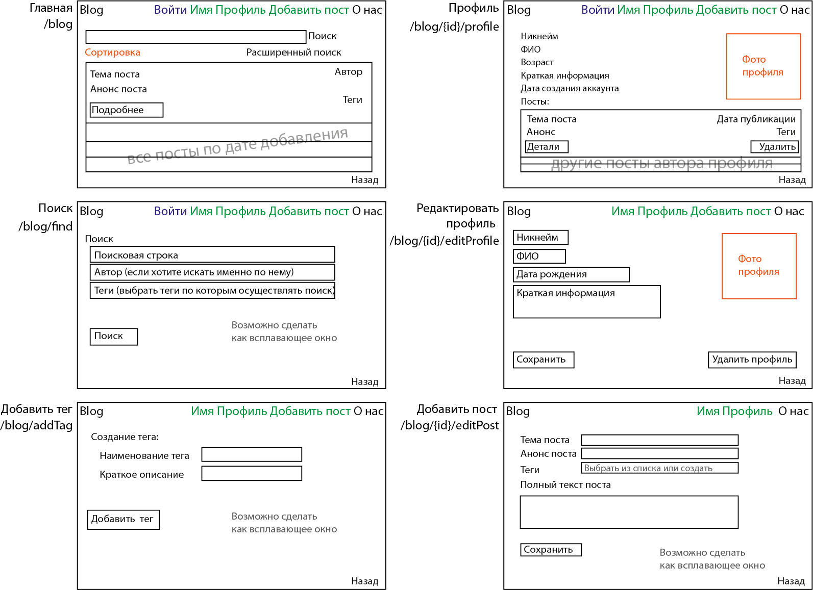
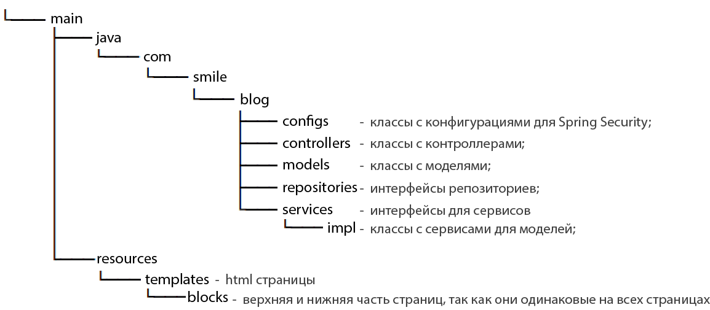

# План работ по проекту

### _Список задач и какие файлы создаются на каждом этапе_

❗ в правом верхнем углу крайние сроки выполнения 

❗ возможны учтены не все файлы

❗ для каждой задачи из списка задач выделяется отдельная ветвь task_<номер задачи.номер подпункта>

❗ для дизайна сайта можно например использовать [Bootstrap](https://getbootstrap.com/docs/5.2/examples/).

### _Структура баз данных_

Под нижней чертой написано, что еще можно добавить кроме запланированного.

## _Планировка сайта_

Синим - когда пользователь не зарегистрирован

Зеленым - когда вошел в профиль

Оранжевым - сделать если останется время до сдачи работы

## _Ожидаемая файловая структура_

