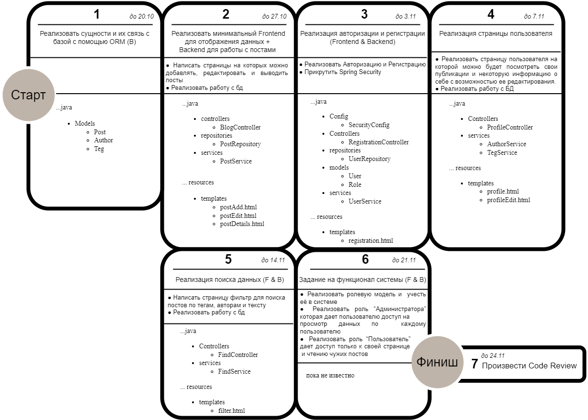

# План работ по проекту

### _Список задач и какие файлы создаются на каждом этапе_

❗ возможны учтены не все файлы

❗ для каждой задачи из списка задач выделяется отдельная ветвь task_<номер задачи.номер подпункта>

### _Структура баз данных_

Под нижней чертой написано, что еще можно добавить кроме запланированного.

### _Список задач_

1. Реализовать сущности и их связь с базой с помощью ORM (Backend) 
    - Сущность “Пост”: (id, author, title, anons, full_text, tags, ) 
        - id – id поста 
        - idAuthor - id автора поста 
        - subjectPost – тема поста 
        - anonsPost -  анонс поста
        - fullTextPost - текст поста  
        - tags - теги 
 
    - Сущность “Пользователь” у нее есть поля: 
        - id – id автора 
        - fioAuthor - фио автора 
        - nickname - никнейм 
        - shortInformation - краткая информация 
        - dateOfBirth - дата рождения
        - dateAdd - дата  создания аккаунта 
 
    - Сущность “Тег” у нее есть поля (id , type,  short_description): 
        - id - id тега 
        - type - наименование тега  
        - shortDescription - краткое описание 
 
2. Реализовать минимальный frontend для отображения данных (Frontend & Backend) 
    - Реализовать Сайт на котором можно добавлять, редактировать и выводить посты 
    - Реализовать работу с базой данных для выполнения данных задач 
  
3. Реализация авторизации и регистрации (Frontend & Backend)   
    - Реализовать Авторизацию и Регистрацию 
    - Прикрутить Spring Security  
 
4. Реализация страницы пользователя 
    - Реализовать страницу пользователя в которой можно будет посмотреть все свои публикации и некоторую информацию о себе с возможностью ее редактирования. 
    - Реализовать работу с базой данных для вывода и редактирования данных по пользователю 
 
5. Реализация поиска данных (Frontend & Backend)     
    - Реализовать страницу, где будет фильтр для поиска постов по тегам, авторам и тексту  
    - Реализовать поиск в базе данных  
    
6. Задание на функционал системы (Frontend & Backend) 
    - Реализовать Ролевую модель и учесть её в системе  
    - Реализовать роль “Администратора” которая дает пользователю доступ на просмотр данных по каждому пользователю 
    - Реализовать роль “Пользователь” дает доступ только к своей странице и чтению чужих постов 
 
7. Задание на читаемость своего кода 
    - Произвести Code Review своего кода 

## _Ожидаемая файловая структура_

