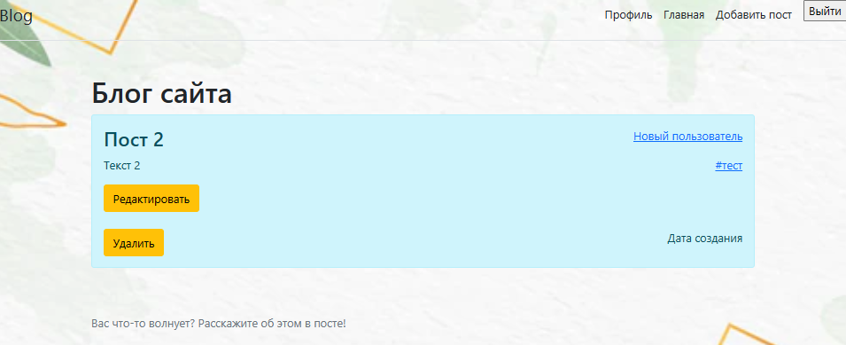

# **Блог**
### _Выполняется для курса "Промышленная разработка на Java (осень 2022)" Naumen_

**Возможности:**

✔ Авторизация и регистрация пользователя при помощи Spring Security

✔ Авторизованный пользователь может создавать, редактировать и удалять свои посты 

✔ У каждого пользователя есть страница "Профиль" на которой есть информация о нем и список его постов. 

✔ Авторизованный пользователь может редактировать свой профиль.

✔ Сохранение постов между сеансами приложения, при помощи PostgreSQL.

✔ Пост можно отметить тегом. Теги можно создавать новые или выбирать из уже имеющихся. Можно смотреть "похожие" теги.

✔ При нажатии на тег, открывается страница на которой есть информация о теге и список публикаций с данным тегом

✔ Поиск постов по тегу, автору и тексту

✔ Пользователь с ролью "АДМИН" может удалять любого пользователя и редактировать права пользователей.

**Скриншоты приложения**

На главной странице находтся список всех постов

Нажав "детальнее" можно открыть полную информацию о любом посте. Например :

Любой пост можно редактировать. Добавление поста выглядит аналогичным образом.

Всегда можно посмотреть свой профиль нажав по кнопке в верхнем правом углу экрана:

    

Есть возможность редактировать свою страницу:

Можно посмотреть список публикаций по определенному тегу:

ADMIN может удалять пользователей и редактировать права пользователей:

    

**Итоги:**
Все задачи которые ставились проекту для прохождения обучающего курса выполнены.
Буду дальше модифицировать данный проект. Пока есть следущие идеи:
- добавить к постам дату их создания и модификации. 
- сделать для пользователей "историю посещений"
- добавить возможность добавлять картинки
- возможность менять фото профиля
- добавить небольшую игру, что бы можно было соревноваться
- добавить возможность ставить лайки
- добавить возможность добавлять в избранное

По технической части:
- добавить шифрование паролей
- усовершенствовать поиск
- добавить тестирование
- поправить работу с CrudRepository
- реализовать какие-то запросы к сторонним онлайн сервисам
- возможно стоит объединить сущности user и author

**Стек технологий**
Maven, Spring, PostgreSql, Bootstrap, Thymeleaf .
