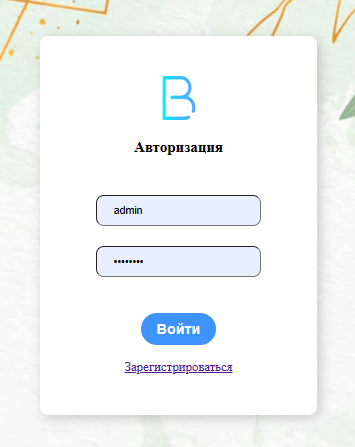
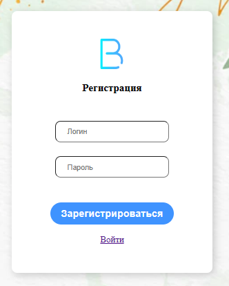
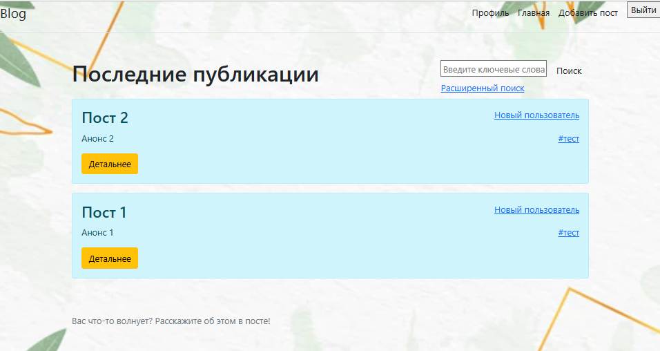
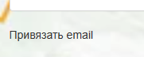

# **Блог**
### _Выполняется для курса "Промышленная разработка на Java (осень 2022)" Naumen_

**Возможности:**

✔ Авторизация и регистрация пользователя при помощи Spring Security

✔ Авторизованный пользователь может создавать, редактировать и удалять свои посты 

✔ У каждого пользователя есть страница "Профиль" на которой есть информация о нем и список его постов. 

✔ Авторизованный пользователь может редактировать свой профиль.

✔ Сохранение постов между сеансами приложения, при помощи PostgreSQL.

✔ Пост можно отметить тегом. Теги можно создавать новые или выбирать из уже имеющихся. Можно смотреть "похожие" теги.

✔ При нажатии на тег, открывается страница на которой есть информация о теге и список публикаций с данным тегом

✔ Поиск постов по тегу, автору и тексту

✔ Пользователь с ролью "АДМИН" может удалять любого пользователя и редактировать права пользователей.

✔ Добавлена возможность менять фото профиля (только для User)

✔ Теперь есть возможность привязать элетронную почту

**Скриншоты приложения**

Сначала надо авторизоваться на сайте или зарегистрироваться на сайте:

    

На главной странице находтся список всех постов

Нажав "детальнее" можно открыть полную информацию о любом посте. Например :

Любой пост можно редактировать. Добавление поста выглядит аналогичным образом.

Всегда можно посмотреть свой профиль нажав по кнопке в верхнем правом углу экрана:

    

Есть возможность редактировать свою страницу:

Можно посмотреть список публикаций по определенному тегу:

ADMIN может удалять пользователей и редактировать права пользователей:

    

На странице «Профиль» для всех зарегистрированных пользователей добавлена функция «привязать email». 

    

При нажатии на «Привязать почту» на указаный электронный адрес отправляется ссылка для активации.  

  

На страннице «Профиль» теперь указывается адрес электронной почты. Его видят все пользователи.

  

**Итоги:**
Все задачи которые ставились проекту для прохождения обучающего курса выполнены.
Буду дальше модифицировать данный проект. Пока есть следущие идеи:
- добавить к постам дату их создания и модификации. 
- сделать для пользователей "историю посещений"
- добавить возможность добавлять картинки
- добавить небольшую игру, что бы можно было соревноваться
- добавить возможность ставить лайки
- добавить возможность добавлять в избранное

По технической части:
- добавить шифрование паролей
- усовершенствовать поиск
- добавить тестирование
- поправить работу с CrudRepository
- реализовать какие-то запросы к сторонним онлайн сервисам
- возможно стоит объединить сущности user и author

**Стек технологий**
Maven, Spring, PostgreSql, Bootstrap, Thymeleaf .
