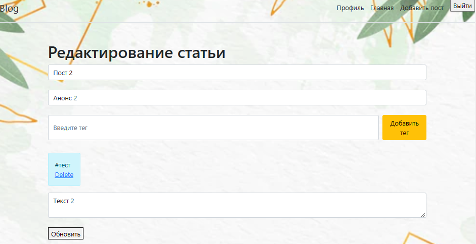

# **Блог**
### _Выполняется для курса "Промышленная разработка на Java (осень 2022)" Naumen_

**Возможности:**

✔ Создание простейших постов только с текстом. 

✔ Возможность редактирования любого поста из списка. 

✔ Удаление постов  

✔ Сохранение постов между сеансами приложения, при помощи PostgreSQL.

✔ Пост можно отметить тегом

✔ Авторизация и регистрация пользователя 

✔ Редактирование страницы пользователя

✔ Добавление новых тегов

✔ Поиск постов по тегу, автору и тексту

**Скриншоты приложения**

На главной странице находтся список всех постов

Нажав "детальнее" можно открыть полный текст любого поста. Например :

Любой пост можно редактировать. Добавление поста выглядит аналогичным образом.

Всегда можно посмотреть свой профиль нажав по кнопке в верхнем правом углу экрана:

Есть возможность редактировать свою страницу:

**Итоги:**
- осталась проблема с токенами
- на странице редактирования профиля не правильно дата выводится
- надо бы добавить к постам дату их создания и модификации. Иначе не попорядку выводятся данные на главный экран.
- можно добавить страницу выводящую по нажатию на хештег поста список других постов по этому тегу

**Стек технологий**
IntelliJ IDEA, SceneBuilder, Maven, Spring, PostgreSql .
